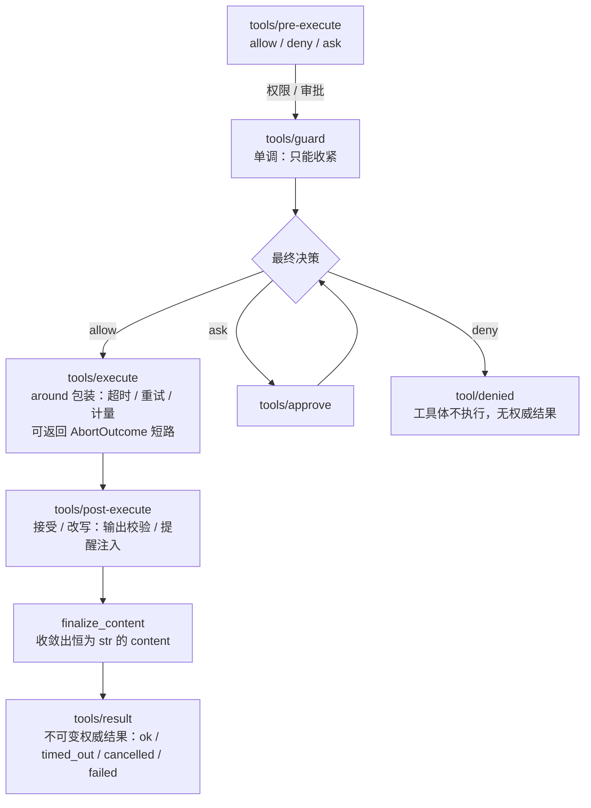
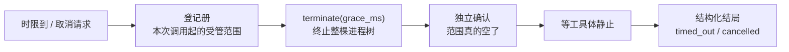
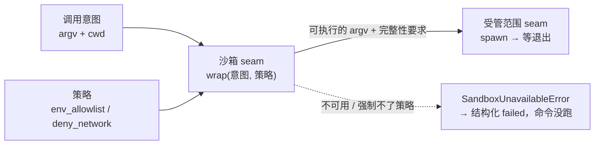
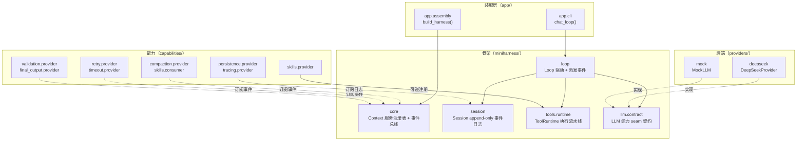
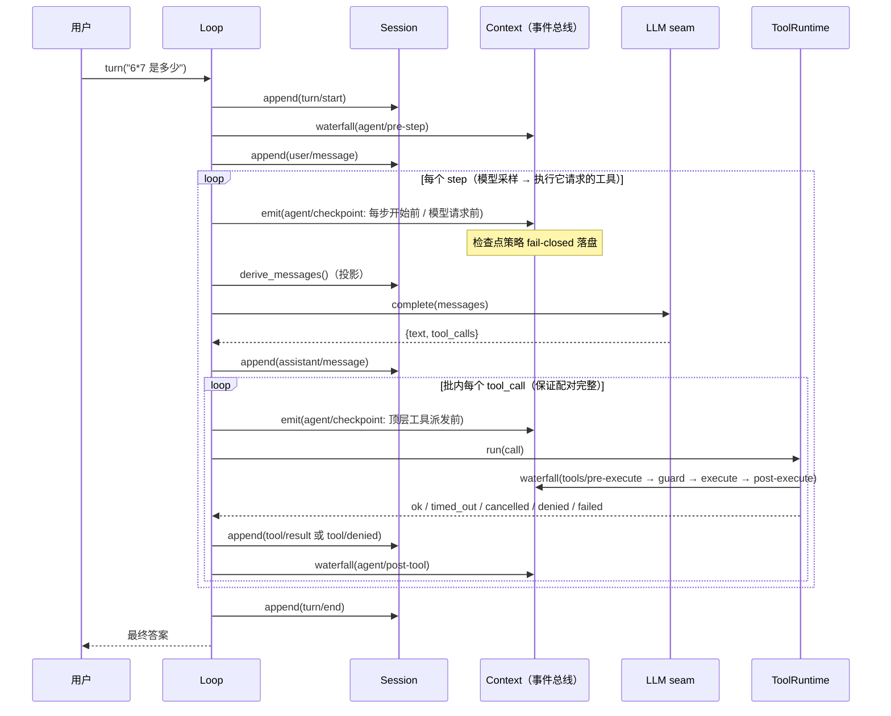
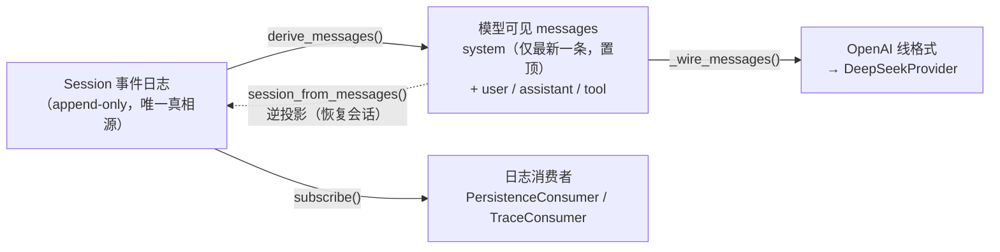
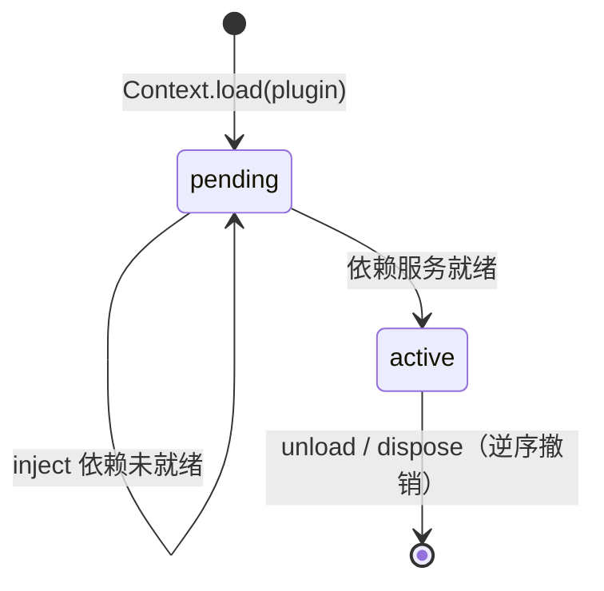

# miniharness —— MiniAgent 的 harness 骨架

`miniharness` 把 Agent 的「循环」与「策略」分开：**循环只负责驱动和派发事件**；重试、超时、压缩、输出校验、终结、持久化、追踪、system prompt 同步，全部是挂在事件 seam 上的插件。

一句话：**改策略，不改循环。**

对照调研见 [`MiniAgent-vs-Codex-Harness.md`](../MiniAgent-vs-Codex-Harness.md)（Codex）与 [`MiniAgent-Harness-Design.md`](../MiniAgent-Harness-Design.md)（三方对比 + 原语提炼）；规格见 [`miniharness-spec.md`](../miniharness-spec.md)。

## 1. 五个原语

| 原语 | 落点 | 说明 |
| --- | --- | --- |
| 循环驱动、事件治理 | `miniharness/core`、`miniharness/loop` | 事件三种派发语义：`emit`（观察）/ `waterfall`（洋葱，可 short-circuit）/ `serial`（按序，返回假则停） |
| 会话 = append-only 事件日志 | `miniharness/session` | `append` 只增不改；`derive_messages()` 是投影；`session_from_messages()` 是其逆 |
| 能力 seam | `miniharness/llm/contract`、`miniharness/tools/{contract,runtime}`、`providers/` | 契约 + Provider + 消费方三分，换后端不动循环 |
| 依赖注入、按需激活 | `Plugin.inject`、`Context.load` | 依赖未就绪则挂起，就绪后自动激活 |
| 注册可逆 | `Context.effect`、`Context.unload` | 每个注册返回 disposer，卸载逆序 unwind；`provide` 的 disposer 被调用时自己出栈（长会话里「临时替换服务、用完还原」不堆效应栈） |

**核心不变量：Model-visible means logged** —— 凡进入模型的内容，都必须能从会话日志重建。

## 2. 工具执行流水线



工具要么以 `ok` 收尾，要么以四种**中止结局**之一收尾，四者带稳定错误码
（`timed_out` / `cancelled` / `denied` / `failed`）、与成功**同构**（同一组键、同一条结果通道），
因此调用方不必接异常，重试策略只读结局码就能决策（见 `capabilities/retry`）。
`deny` 不产生权威结果：落 `tool/denied`、不发 `tools/result`、工具体不执行。

## 3. 包地图

工程按能力族包化：契约低频、实现高频，二者不同包。五个族各有一份权威包地图（族内 `README.md`）：

| 族 | 内容 | 包地图 |
| --- | --- | --- |
| `miniharness/` | 骨架：`core`（Context/Plugin）、`session`（事件日志 + 投影）、`tools/{contract,runtime}`、`llm/contract`、`process/contract`、`sandbox/contract`、`loop`（零策略） | [`miniharness/README.md`](../miniharness/README.md) |
| `capabilities/` | 能力族：每个能力按 `definition`（契约）/ `provider`（实现）/ `consumer`（消费方）拆包——压缩 / 持久化 / 重试 / 超时 / 校验 / 追踪 / 技能 / 审批 / 沙箱 / 命令执行 / 终结 | [`capabilities/README.md`](../capabilities/README.md) |
| `providers/` | 后端族：`deepseek`（真实）、`mock`（离线）、`process`（受管范围的平台后端）、`sandbox`（沙箱后端） | [`providers/README.md`](../providers/README.md) |
| `app/` | 装配族：`config` / `tools` / `assembly`（`build_harness`）/ `cli`（`chat_loop`）/ `__main__` | [`app/README.md`](../app/README.md) |
| `tests/` | 测试族：跨包集成集中一处；包内测试与实现同层 | [`tests/README.md`](../tests/README.md) |

落位、命名、依赖方向与测试放置的规范见 [`docs/packaging.md`](packaging.md)。

## 4. 迁移对照

| legacy（写在循环里） | 现在（挂在 seam 上） |
| --- | --- |
| `ctx.maybe_compact(...)` | `CompactionPlugin` → `agent/pre-step`（surface 替换） |
| `with_retry(...)` | `RetryPlugin` → `tools/execute`（around） |
| `call_with_timeout(...)` | `ToolTimeoutPlugin` → `tools/execute`（around） |
| 输出校验 / sanitize | `ValidationPlugin` → `tools/post-execute` |
| `pm.save_session(...)` | `PersistenceConsumer` → Session 日志订阅（有界写后缓冲；`flush()` 屏障；订阅 `agent/checkpoint` 在三个语义点 fail-closed 落盘） |
| `tracer.*(...)` | `TraceConsumer` → Session 日志订阅 |
| `skills.load` + 工具注册 | `SkillRegistry` → `ToolRuntime` 可逆注册 |
| `build_system_prompt` 每步覆写 | `SystemPromptPlugin` → `tools/result` / `agent/pre-step` |
| `OUTPUT_TOOL_NAMES` 硬编码终结 | `FinalOutputPlugin` → `agent/post-tool`（Loop 不认识工具名） |

### 两处有意偏离 legacy

1. **超时报 `timed_out`，不是一个字符串、也不再混同于 `failed`**：legacy 的 `CallFunc.call_with_timeout`
   把超时也返回成字符串，管道只好把它当成功。现在 `ToolTimeoutPlugin` 返回结构化的
   `AbortOutcome(timed_out)`，权威结果带稳定的 `timed_out` 码，下游（重试、呈现）按码区分
   「超时」「取消」「被拒」「失败」与「成功」。
2. **`AgentTrace.log_llm_call` 改收纯数据**：原签名吃 OpenAI SDK 的响应对象，逼得日志消费者伪造一个假响应。现在只收已归一化的 `messages` / `content` / `tool_calls`，SDK 形状的耦合留在 provider 一层。

### 超时 / 取消：终止受管范围

超时与取消**不再是「停止等待」的口头承诺**。`ToolTimeoutPlugin` 在本次工具调用期间把 `process`
服务包成一层登记代理——工具体在调用时刻经 `ctx.get("process")` 取 seam，所以策略层能在这层接线，
工具自己不用认识终止：



- **终止以受管范围为单位**：整棵进程树（含后代）一起停，不靠一个个杀进程；`terminate` 返回即
  范围已退出，接线处再 `poll()` 独立确认一次——终止没达成目的就抛 `TerminationError`，
  **不把「其实还活着」报成超时**。**终止手段随平台**：POSIX 后端先 `SIGTERM` 全组、宽限期满仍
  不退再 `SIGKILL`（升级档的真实触发用例见 `providers/process/test_managed_range.py`，本机
  skip）；**Windows 后端没有升级档**——Job Object 的 `TerminateJobObject` 一次强杀到底，
  `grace_ms` 在那里只是等工具体静止的上限。
- **已启动的工具体跑到静止后才允许替换其结果**：先终止实体，再等它自己的等待返回，最后才用
  中止结局替换它本会产出的值。
- **取消与超时同一条路径**，区别只在结局码。取消入口是 `ToolTimeoutPlugin.cancel()`
  （同时以 `ctx.get("abort")` 暴露）。**取消源在装配层**：`app.cli.InterruptSource` 把
  **回合执行期间**的 Ctrl-C 换成一次 `cancel()`（`chat_loop` 每轮用 `armed(ctx)` 划出这个
  窗口）——正在跑的受管范围被终止、该回合以结构化的 `cancelled` 收尾，**聊天循环继续**；
  `input()` 提示处的 Ctrl-C 不被接管，仍是退出（既有行为）。
  取消源是**主线程上的信号处理**，而信号未必递到主线程（Windows 上实测：整段睡满时 0.5 秒
  递到的信号要等时限到才被处理），所以等待者按片检查中止请求（`_WAIT_SLICE_S`）、本插件的锁
  可重入——这两条是「接上取消源」的必要条件，不是另一套终止逻辑。
  中断时刻可注入（`InterruptSource.interrupt()`），集成用例见 `tests/test_cli_cancel.py`。
- **一次取消粘到本轮**（`capabilities.timeout.provider.TurnCancelPlugin`：**收尾是策略，落在
  能力层**；`app.cli.InterruptSource` 只剩信号装配）。取消登记在 `ToolTimeoutPlugin` 上，回合
  边界（`agent/pre-step`）清除；四个落点：
  - `tools/guard`：本轮余下的工具调用一律 `deny`，**审批也不会被询问**。挂 guard 而不是
    `tools/pre-execute`——后者是洋葱瀑布，审批策略对 `run_command` 直接给出 `ask`、不调
    `next_`，挂在那里的守卫会被短路、永不被调用（`deny` 比 `ask` 更严，单调收紧的语义不变）。
  - `tools/execute` 的**入口复查**：重试重入 `tools/execute` 是「重新进流水线」，不重跑
    pre-execute / guard——退避期间到来的取消因此在这里收住，一个进程也不起。
  - `agent/post-tool`：权威结果为 `cancelled` → 本轮就此收尾、不再采样。
  - llm seam：取消之后模型**只回文本**时，那条文本换成取消说明（`⏹️ 已取消本轮：…`）——没有
    工具调用的这一路，`agent/post-tool` 不会被派发，而 `Loop` 收到纯文本就自己写
    `turn/end=done` 并把它当答案返回。`turn/end` 的词表归 `Loop`，策略不代写，所以这条路径的
    收场是「`done` + 取消说明」：模型可见历史（日志里的 `assistant/message`）与用户看到的答复
    都写着这轮是被人取消的，不是一次什么都没发生的正常收尾。
  **没有命令在跑时**：取消请求无处可终止（`cancel()` 返回 False），本轮同样就此打住、不退出。
- **每次尝试各有各的册**：`timed_out` 可重试（`capabilities.retry.definition.RETRYABLE_OUTCOMES`），
  默认重试策略**会**重试它；重试的第 N 次重新起进程、重新登记，上一次的树早已终止，互不牵连
  （取消之后不会再有第 N 次：上面的入口复查把它收住了）。

**剩余边界**：没有受管范围可终止的工具体（纯 Python 的慢工具）只能「停止等待」——Python 杀不掉
线程，被放弃的工具体仍会跑到底，它已产生的副作用（例如慢写文件留下的半成品）**不会回滚**。
因此工具体一律跑在 **daemon** 线程里（`threading.Event.wait(timeout)` 限时），而不是
`ThreadPoolExecutor`：非 daemon 的 worker 会在解释器退出时被 `_python_exit` join，于是一个卡死的
工具**能把整个进程挂到它跑完**。legacy 的 `CallFunc.call_with_timeout` 正是如此——
`with ThreadPoolExecutor(...)` 退出即 `shutdown(wait=True)`，那句「已取消执行」其实是在**等到底
之后**才返回的。`test_timeout_does_not_block_process_exit` 用子进程守住这条。

**文件系统与网络级隔离仍未实现**：`EnvSandbox` 不隔离文件系统，`deny_network` 只拒绝、不强制。

同理，`ToolRuntime` 只保证「批内每个 `tool_call` 都落一条配对结果」（否则下一轮上行会被兼容接口以 tool_calls 未配对拒绝）；进程型工具体现在真会停，但上面那条「杀不掉线程」的边界对纯 Python 工具体依旧成立。

### 沙箱：只包装 argv，不可用即 fail-closed

`run_command` 起进程之前先过**沙箱 seam**（`miniharness.sandbox.contract` / `providers.sandbox`）：



- 沙箱**只包装 argv**：它不认识终止、也不起进程；起进程、等退出、终止整棵树都是受管范围的事。
  两个 seam 分居两组契约，是因为它们回答的问题不同（隔离 vs 生命周期）、变化的理由也不同。
- **fail-closed**：seam 没装、装配后被卸载、或**拒绝服务**（策略超出后端能力、解析不出可执行
  文件）时，`run_command` 抛 `SandboxUnavailableError`，由 `ToolRuntime` 规范成结构化的
  `failed` 结局——**绝不回退**到不经沙箱直接执行。
- 沙箱里跑的命令，退出码与两个流仍走**同一条结果通道**（`tools/result`），下游看不出差别。
- `EnvSandbox` 强制的是**环境收敛**（白名单之外一个都不继承，**环境变量里的**凭据不外泄）与
  **裸命令名在收敛后 PATH 里的解析**（`argv[0]` 是裸名时跑哪个二进制由沙箱决定）；它强制不了
  的隔离要求（例如 `deny_network`）**拒绝服务**，而不是假装生效。收敛会连带改变子进程的默认
  文本编码，所以编码相关的变量由策略白名单留住——装配层给的是
  `app.assembly.SHELL_ENV_ALLOWLIST`。
- **它不做什么**（别把这一层当成完整沙箱）：**不隔离文件系统**——子进程的 cwd 就是 agent 的
  cwd，一条 `run_command`（例如 `python -c`）能读走仓库根的 `config.json` 或
  `~/.aws/credentials`；**不强制断网**——`deny_network` 只是拒绝，不是隔离机制；**白名单只管
  环境变量**——`HOME` / `USERPROFILE` 仍在白名单里，磁盘上的凭据文件与 socket 都不在它的
  射程内；**绝对路径不受限制**——`argv[0]` 带路径时 `_resolve` 原样放行，「跑哪个二进制由
  沙箱决定」只对裸名成立。

### 写盘：有界写后缓冲 + 屏障 + 三个检查点

事件先入内存日志（`Session.events`），再进**有界写后缓冲**：缓冲未满不落盘，满容或回合边界时
批量落盘——写盘次数不随 `append` 次数增长，待落盘项也不会无限堆积。`PersistenceConsumer.flush()`
是**显式屏障**：它返回才构成崩溃承诺，重复调用幂等（没有待落盘项时不触碰盘）。

`Loop` 在三个语义点派发 `agent/checkpoint`——**每步开始前 / 向模型发起请求前 / 顶层工具派发前**；
持久化能力订阅它并 fail-closed 地过屏障：屏障抛错就不让下游的副作用发生。于是一旦模型真的被请求、
工具真的跑了，它们所依赖的历史已经在盘上。写失败时未落盘项留在队列里可原地重试，写残的尾行在
下次写入前修掉——日志不出现半条记录，崩溃后仍可解析、可重放（丢的只是屏障之后的事件）。

### 一处未装（T9 起收窄为例外）

`build_harness()` 原先**不装 `PermissionPlugin`**——legacy 没有审批概念，装了会改变行为。
T9 之后装配层只为**一个**工具开例外：`run_command` 给出 `ask`，没有审批者时默认拒绝
（工具体不执行），其余工具行为不变——真正执行外部命令的工具才需要这道门槛。
审批能力本身在 `capabilities/permission/provider/` 里，需要时按 §5 自行装配。

## 5. 怎么加一个策略（不碰 Loop）

```python
class AuditPlugin(Plugin):
    inject = ("tools",)

    def apply(self, ctx):
        ctx.on("tools/pre-execute", self._pre)

    def _pre(self, payload, next_):
        log(payload["call"])          # 观察
        return next_()                # 放行；返回 {"kind": "deny", ...} 即短路
```

`Loop` 一行都不用改——这正是本骨架存在的理由。

## 6. 测试 seam

| seam | 层 | 覆盖 |
| --- | --- | --- |
| **S2** | `Loop.turn`（集成） | 工具体执行、`tool/result` 按序入日志、最终答案正确；deny 时工具体不执行；终结工具收尾本轮；**只换装配的插件就改变结局，而 Loop 零改动** |
| **S3** | `ToolRuntime.run`（契约） | 四种中止结局（超时 / 取消 / 被拒 / 失败）各有稳定码且与成功同构、同走 `tools/result`；deny → 工具体不执行；单调 guard 不可反向放行；ask 无审批者默认拒绝 |
| **S5** | `Session` 投影（纯函数） | 确定且幂等；只含 model-visible 事件；压缩是 surface 替换、原日志可重放；`session_from_messages` 往返等价 |

事件总线原语与插件装载 / disposer 是框架原语，按规格**不设 seam**。

沙箱 seam 也不是新的**测试** seam（规格只新增「进程边界」一个）：它没有独立的进程语义，
可观察行为分别落在 `providers/sandbox/test_env_sandbox.py`（它真能强制的维度）与
`tests/test_sandbox.py`（装配后的 fail-closed 失败注入 + 非空洞对照）；「沙箱不负责终止」
的证据在 `tests/test_shell.py` 那条外部终止受管范围的用例里（同一条命令先过沙箱）。

超时 / 取消 → 终止的接线用的是同一个「进程边界」seam：接线本身（登记册、终止、结局）在
`capabilities/timeout/provider/test_timeout.py` 用受管范围替身验；「进程真的没了」在
`tests/test_timeout.py` 用**真实子进程**验，并由操作系统独立确认
（`providers.process.probe._alive`，不采信被测实现自己的返回值）。**「宽限 → 强杀」升级档
只有 POSIX 后端有**（Windows 的 Job Object 一次强杀到底），它的真实触发用例带
`skipif(os.name == "nt")`，只在 POSIX 上实跑。核心原语的效应栈语义在
`miniharness/core/test_context.py` 验。

**取消源**（`Loop` 之外的触发条件）在 `tests/test_cli_cancel.py`：驱动真实的 `chat_loop`，
中断时刻可注入（`InterruptSource.interrupt()`），进程树由操作系统独立确认；另有一条真实
SIGINT 用例（`signal.raise_signal`，由另一个线程递出——正是平台把信号递进来的样子）与一条
真实终端里的 `python -m app` 手工核实。取消粘到本轮的三个落点各有用例：守卫跑在审批**之前**
（本轮已取消时审批名单里的工具既不执行、也不弹框）、退避期间的中断之后重试不再起进程（替身
记 spawn 次数，进程由系统侧确认）、取消之后模型只回文本时不给一次看起来正常的 `done`。三条
都做过**失败注入**：把守卫放回 `tools/pre-execute`、去掉 `tools/execute` 的入口复查，对应用例
立即变红。

## 7. 运行

```bash
pip install -r requirements.txt
# 在项目根目录创建 config.json（已 .gitignore）
python -m app
```

离线跑（不联网，用 mock provider）：

```python
from app.assembly import build_harness
from providers.mock import MockLLM

llm = (MockLLM()
       .then_tool_call("load_skill", {"name": "calculator"})
       .then_tool_call("calculate", {"expression": "6*7"})
       .then_text("42"))
ctx, session, loop = build_harness(model="mock", llm=llm, store_dir="./agent_sessions")
print(loop.turn("6*7 是多少"))
print([e["type"] for e in session.events])
```

不写代码的离线 smoke run：

```bash
python -m app.skeleton_demo     # 骨架：依赖驱动激活顺序 + deny 分支
python -m app.stack_demo        # 全栈：压缩 / 重试 / 超时 / 持久化 / 追踪 / 技能
python -m app.deepseek_demo     # 真实联调（需根目录 config.json，会联网）
```

测试：

```bash
python -m pytest -q
```

## 8. 设计图（mermaid）

### 8.1 架构总览：谁依赖谁



### 8.2 一次 turn 的时序



### 8.3 事件日志与模型可见历史



### 8.4 插件的依赖驱动激活



> 工具执行流水线的图形版见 §2；策略如何注入见 §5。
