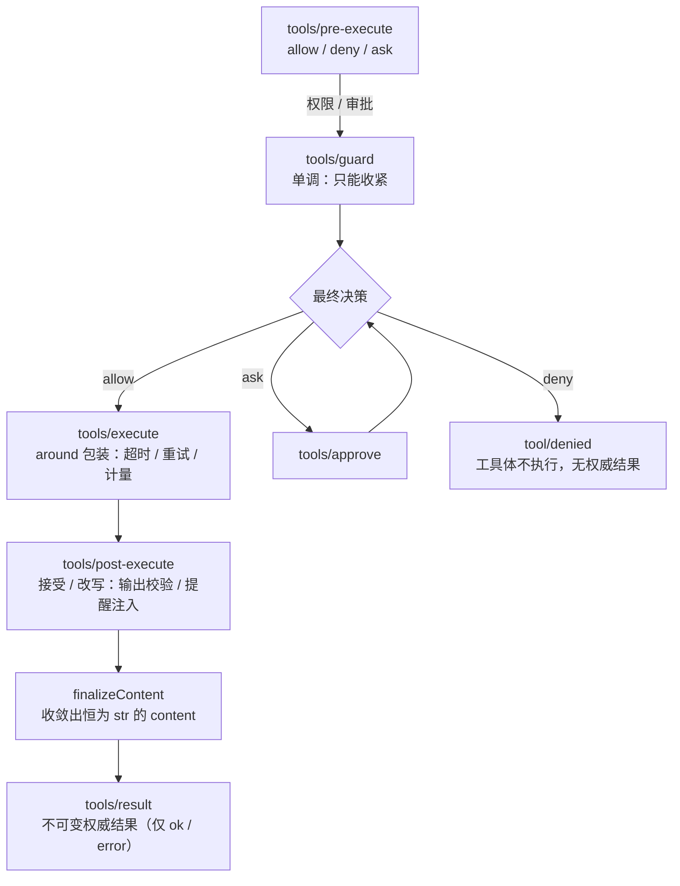
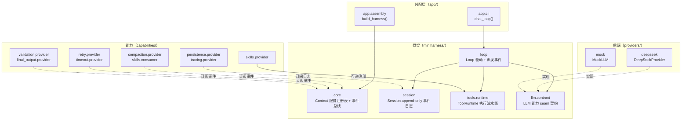
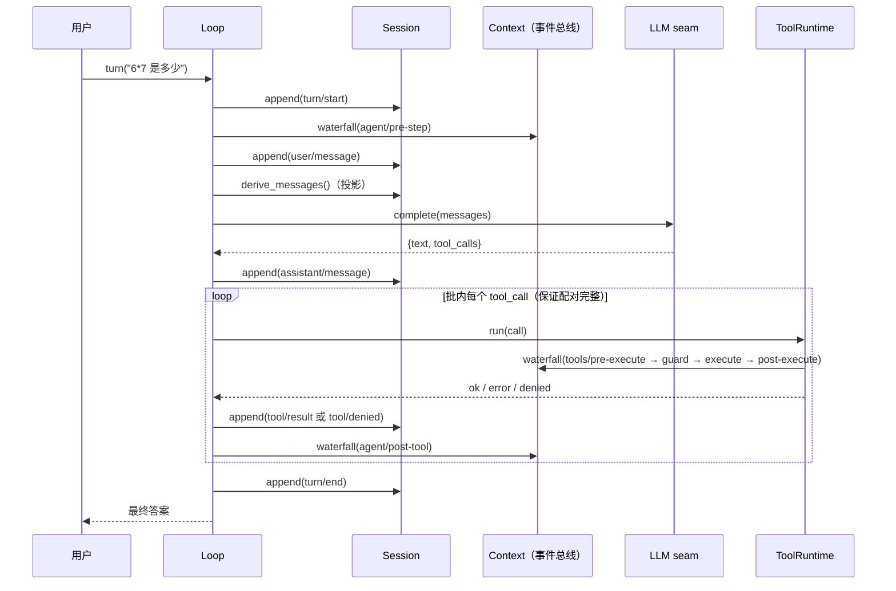
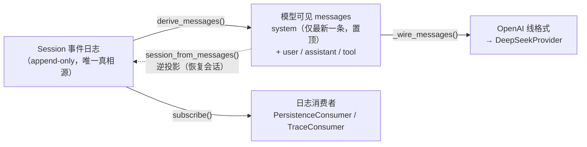
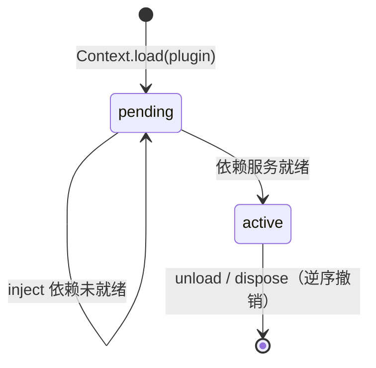

# miniharness —— MiniAgent 的 harness 骨架

`miniharness` 把 Agent 的「循环」与「策略」分开：**循环只负责驱动和派发事件**；重试、超时、压缩、输出校验、终结、持久化、追踪、system prompt 同步，全部是挂在事件 seam 上的插件。

一句话：**改策略，不改循环。**

对照调研见 [`MiniAgent-vs-Codex-Harness.md`](../MiniAgent-vs-Codex-Harness.md)（Codex）与 [`MiniAgent-Harness-Design.md`](../MiniAgent-Harness-Design.md)（三方对比 + 原语提炼）；规格见 [`miniharness-spec.md`](../miniharness-spec.md)。

## 1. 五个原语

| 原语 | 落点 | 说明 |
| --- | --- | --- |
| 循环驱动、事件治理 | `miniharness/core`、`miniharness/loop` | 事件三种派发语义：`emit`（观察）/ `waterfall`（洋葱，可 short-circuit）/ `serial`（按序，返回假则停） |
| 会话 = append-only 事件日志 | `miniharness/session` | `append` 只增不改；`derive_messages()` 是投影；`session_from_messages()` 是其逆 |
| 能力 seam | `miniharness/llm/contract`、`miniharness/tools/{contract,runtime}`、`providers/` | 契约 + Provider + 消费方三分，换后端不动循环 |
| 依赖注入、按需激活 | `Plugin.inject`、`Context.load` | 依赖未就绪则挂起，就绪后自动激活 |
| 注册可逆 | `Context.effect`、`Context.unload` | 每个注册返回 disposer，卸载逆序 unwind |

**核心不变量：Model-visible means logged** —— 凡进入模型的内容，都必须能从会话日志重建。

## 2. 工具执行流水线



`deny` 不产生权威结果：落 `tool/denied`、不发 `tools/result`、工具体不执行。

## 3. 包地图

工程按能力族包化：契约低频、实现高频，二者不同包。五个族各有一份权威包地图（族内 `README.md`）：

| 族 | 内容 | 包地图 |
| --- | --- | --- |
| `miniharness/` | 骨架：`core`（Context/Plugin）、`session`（事件日志 + 投影）、`tools/{contract,runtime}`、`llm/contract`、`loop`（零策略） | [`miniharness/README.md`](../miniharness/README.md) |
| `capabilities/` | 能力族：每个能力按 `definition`（契约）/ `provider`（实现）/ `consumer`（消费方）拆包——压缩 / 持久化 / 重试 / 超时 / 校验 / 追踪 / 技能 / 审批 / 终结 | [`capabilities/README.md`](../capabilities/README.md) |
| `providers/` | 后端族：`deepseek`（真实）、`mock`（离线） | [`providers/README.md`](../providers/README.md) |
| `app/` | 装配族：`config` / `tools` / `assembly`（`build_harness`）/ `cli`（`chat_loop`）/ `__main__` | [`app/README.md`](../app/README.md) |
| `tests/` | 测试族：跨包集成集中一处；包内测试与实现同层 | [`tests/README.md`](../tests/README.md) |

落位、命名、依赖方向与测试放置的规范见 [`docs/packaging.md`](packaging.md)。

## 4. 迁移对照

| legacy（写在循环里） | 现在（挂在 seam 上） |
| --- | --- |
| `ctx.maybe_compact(...)` | `CompactionPlugin` → `agent/pre-step`（surface 替换） |
| `with_retry(...)` | `RetryPlugin` → `tools/execute`（around） |
| `call_with_timeout(...)` | `ToolTimeoutPlugin` → `tools/execute`（around） |
| 输出校验 / sanitize | `ValidationPlugin` → `tools/post-execute` |
| `pm.save_session(...)` | `PersistenceConsumer` → Session 日志订阅 |
| `tracer.*(...)` | `TraceConsumer` → Session 日志订阅 |
| `skills.load` + 工具注册 | `SkillRegistry` → `ToolRuntime` 可逆注册 |
| `build_system_prompt` 每步覆写 | `SystemPromptPlugin` → `tools/result` / `agent/pre-step` |
| `OUTPUT_TOOL_NAMES` 硬编码终结 | `FinalOutputPlugin` → `agent/post-tool`（Loop 不认识工具名） |

### 两处有意偏离 legacy

1. **超时报 `error` 而非 `ok`**：legacy 的 `CallFunc.call_with_timeout` 把超时也返回成字符串，管道只好把它当成功。现在 `ToolTimeoutPlugin` 抛 `ToolTimeout`，权威结果明确是 `error`，下游可按 `status` 区分「超时」与「成功」。
2. **`AgentTrace.log_llm_call` 改收纯数据**：原签名吃 OpenAI SDK 的响应对象，逼得日志消费者伪造一个假响应。现在只收已归一化的 `messages` / `content` / `tool_calls`，SDK 形状的耦合留在 provider 一层。

### 超时的边界（已知限制）

超时**只能「停止等待」，不能「取消执行」**。工具体跑在线程里，而 Python 杀不掉线程，所以一次超时意味着：

- 立刻返回结构化 `error`（`工具 <name> 执行超时（<N>ms 未返回）`），不再等它；
- 丢弃它的返回值；
- **但不会停止它**——被放弃的工具体仍会跑到底，它已产生的副作用（例如慢写文件留下的半成品）**不会回滚**。

一个实现细节值得记住：工具体跑在 **daemon 线程**里（`threading.Event.wait(timeout)` 限时），而不是 `ThreadPoolExecutor`。非 daemon 的 worker 会在解释器退出时被 `_python_exit` join，于是一个卡死的工具**能把整个进程挂到它跑完**。legacy 的 `CallFunc.call_with_timeout` 正是如此——`with ThreadPoolExecutor(...)` 退出即 `shutdown(wait=True)`，那句「已取消执行」其实是在**等到底之后**才返回的。`test_timeout_does_not_block_process_exit` 用子进程守住这条：修复前该测试会挂满超时。

真正的取消与副作用隔离需要**进程级边界或沙箱**，属规格的 Out of Scope，不在本骨架范围。

同理，`ToolRuntime` 只保证「批内每个 `tool_call` 都落一条配对结果」（否则下一轮上行会被兼容接口以 tool_calls 未配对拒绝），**不保证**被放弃的工具体停止运行。

### 一处未装

`build_harness()` **不装 `PermissionPlugin`**——legacy 没有审批概念，装了会改变行为。审批能力本身在 `capabilities/permission/provider/` 里，需要时按 §5 自行装配。

## 5. 怎么加一个策略（不碰 Loop）

```python
class AuditPlugin(Plugin):
    inject = ("tools",)

    def apply(self, ctx):
        ctx.on("tools/pre-execute", self._pre)

    def _pre(self, payload, next_):
        log(payload["call"])          # 观察
        return next_()                # 放行；返回 {"kind": "deny", ...} 即短路
```

`Loop` 一行都不用改——这正是本骨架存在的理由。

## 6. 测试 seam

| seam | 层 | 覆盖 |
| --- | --- | --- |
| **S2** | `Loop.turn`（集成） | 工具体执行、`tool/result` 按序入日志、最终答案正确；deny 时工具体不执行；终结工具收尾本轮；**只换装配的插件就改变结局，而 Loop 零改动** |
| **S3** | `ToolRuntime.run`（契约） | deny → 工具体不执行；单调 guard 不可反向放行；ask 无审批者默认拒绝；工具异常收敛为结构化 error |
| **S5** | `Session` 投影（纯函数） | 确定且幂等；只含 model-visible 事件；压缩是 surface 替换、原日志可重放；`session_from_messages` 往返等价 |

事件总线原语与插件装载 / disposer 是框架原语，按规格**不设 seam**。

## 7. 运行

```bash
pip install -r requirements.txt
# 在项目根目录创建 config.json（已 .gitignore）
python -m app
```

离线跑（不联网，用 mock provider）：

```python
from app.assembly import build_harness
from providers.mock import MockLLM

llm = (MockLLM()
       .then_tool_call("load_skill", {"name": "calculator"})
       .then_tool_call("calculate", {"expression": "6*7"})
       .then_text("42"))
ctx, session, loop = build_harness(model="mock", llm=llm, store_dir="./agent_sessions")
print(loop.turn("6*7 是多少"))
print([e["type"] for e in session.events])
```

不写代码的离线 smoke run：

```bash
python -m app.skeleton_demo     # 骨架：依赖驱动激活顺序 + deny 分支
python -m app.stack_demo        # 全栈：压缩 / 重试 / 超时 / 持久化 / 追踪 / 技能
python -m app.deepseek_demo     # 真实联调（需根目录 config.json，会联网）
```

测试：

```bash
python -m pytest -q
```

## 8. 设计图（mermaid）

### 8.1 架构总览：谁依赖谁



### 8.2 一次 turn 的时序



### 8.3 事件日志与模型可见历史



### 8.4 插件的依赖驱动激活



> 工具执行流水线的图形版见 §2；策略如何注入见 §5。
