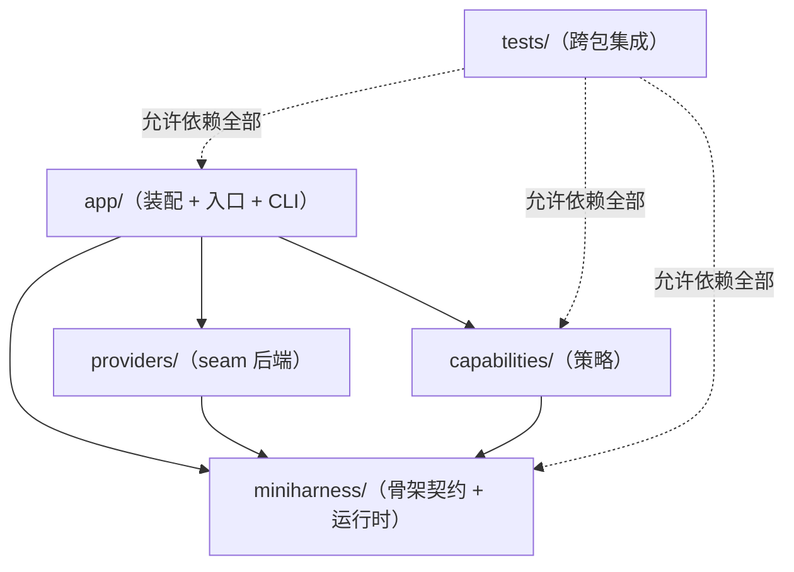

# 工程落位规范（packaging）

本文件是新代码落位、命名、依赖方向与测试放置的**唯一权威规范**，供人与 agent 共同遵循。
族的包地图（「哪个包干什么」）在各族自己的 `README.md` 里；本文件管**规则**。

包化本身是纯搬移：只改文件位置与 import，行为逐字不变（见 §7）。

## 1. 三条规则

1. **按能力族分组**：每个包恰属一个族；新包优先并入已有族，不加新族除非确有第四层职责。
2. **命名按「当前存在的角色」**：名字描述它现在是什么（`provider`、`consumer`、`contract`、
   `runtime`），不描述将来可能变成什么；**不建空壳包**，不预留目录。
3. **按变化速率拆包**：契约（低频）与实现（高频）分属不同包。频繁变动的策略改动，
   不许牵动稳定接口；反之亦然。

## 2. 五个族

| 族 | 职责 | 权威包地图 |
| --- | --- | --- |
| `miniharness/` | 骨架：低频的契约与运行时（事件原语、会话日志、工具/LLM/进程 seam 的契约、零策略循环） | [`miniharness/README.md`](../miniharness/README.md) |
| `capabilities/` | 能力族：骨架之上的策略，每个能力按角色与变化速率拆包 | [`capabilities/README.md`](../capabilities/README.md) |
| `providers/` | 后端族：骨架 seam 的实现（LLM 采样、受管范围的平台后端） | [`providers/README.md`](../providers/README.md) |
| `app/` | 装配族：把骨架 / 能力 / 后端装成可运行的应用与入口 | [`app/README.md`](../app/README.md) |
| `tests/` | 测试族：跨包集成集中于此 | [`tests/README.md`](../tests/README.md) |

根目录只放族的入口与文档，不再放模块：包化之前那 9 个平铺模块已经全部落进上述五族。

## 3. 三个具名角色

一个能力 = 三个角色，**分属不同包**：

| 角色 | 是什么 | 落点 |
| --- | --- | --- |
| **Definition（契约）** | 稳定、低频的类型与语义：接口、类型、事件词汇表 | `<能力>/definition/`；若契约就是骨架上的事件 seam（如 `tools/pre-execute` 的决策词汇、`agent/post-tool` 的收尾协议），则留在 `miniharness/` |
| **Provider（实现）** | 契约的具体实现，变动频繁 | `<能力>/provider/`（骨架 seam 的后端在 `providers/`） |
| **Consumer（消费方）** | 只经契约消费该能力，不实现它 | `<能力>/consumer/`，或骨架 / 装配层的包（`miniharness.loop`、`app.assembly`…） |

判定一个类属于哪个角色，问三个问题：

1. 它定义的是**形状/语义**，还是**某种做法的实现**？前者是 Definition，后者是 Provider。
2. 换掉它会不会牵动别的包？会 → 它多半是契约，应该更稳定、放更低频的包。
3. 它是否只读取别人的状态、不改变对方？是 → Consumer。

每个能力的三个角色分别落在哪个包，见 [`capabilities/README.md`](../capabilities/README.md) 的包地图。
**不为了凑齐三个角色而建空壳包**：没有独立 Consumer 代码的能力，就指明谁是它的消费方，不建目录。

## 4. 依赖方向



规则：

- **只向下**：`app` → `capabilities` / `providers` → `miniharness`。下层**不认识**上层：
  骨架里没有 import 任何 `capabilities` / `providers` / `app`。
- **消费方只依赖契约**：`miniharness.loop` 依赖 `session` / `tools.runtime` / `llm.contract`，
  不认识任何策略插件与后端；`providers.deepseek` 只依赖 `llm.contract` 与 `core`，
  `providers.process` 只依赖 `process.contract` 与 `core`。
- **契约不反向依赖实现**：`capabilities/<能力>/definition/` 不 import 同能力的 `provider`；
  `miniharness.tools.contract` 不 import `miniharness.tools.runtime`。
- **能力之间**：可以依赖对方的**契约**，不要依赖对方的实现。确有实现级协同时，
  由 `app/` 装配处接线（例如终结工具名由 `app.assembly` 注入 `FinalOutputPlugin`、
  恢复时由它在重放后派发一次 `session/replayed`，持有日志派生状态的插件各自订阅折叠，
  而不是让持久化 provider 去 import 压缩与技能的实现）。
- **tests** 可以依赖所有族；包内测试只依赖本包与更下层（跨层的断言属于 `tests/`）。

同族内部 import 一律用**绝对包路径**（`from miniharness.session import Session`），
不用相对 import，也不用 `sys.path` 技巧；同名模块靠包名区分（`miniharness.tools` 与
`app.tools` 是两个不同的包，互不遮蔽）。

## 5. 命名

- 族的目录名：`miniharness` / `capabilities` / `providers` / `app` / `tests`。
- 角色的目录名：`definition` / `provider` / `consumer`（小写、单数、无下划线）。
- 包内实现直接写在 `__init__.py`：包的公开面就是它导出的名字，不再套一层同名模块
  （不写 `session/session.py`），也不做 re-export 垫片。
- 一个包只导出它自己的东西；跨包复用一律走 import，不做转发。
- 中间包（`miniharness/tools`、`miniharness/llm`、`capabilities/<能力>`）只承载它下面角色包的归属：
  `__init__.py` 写这层能力/角色的说明，不放实现，也不重复下层代码。它们不是空壳包——
  空壳指的是「没有当前角色、只为将来预留」的目录。

## 6. 测试放置

- **与实现同层但分离**：测试放独立文件，实现文件里不出现测试代码。
  - 包内测试：与实现同一个包，文件名 `test_<主题>.py`
    （`miniharness/session/test_projection.py`、`capabilities/retry/provider/test_retry.py`）；
  - 一个包里多个测试文件时，共享 helper 放同包的非 `test_*.py` 模块。
- **跨包集成集中一处**：驱动 `Loop.turn`、装配整个 app 的断言只放 `tests/`。
- **共享 helper**：集成测试的装配 helper 放 `tests/support.py`；下层包内的测试 helper
  放在下层包里（例如 `miniharness/tools/runtime/test_pipeline.py` 的 `_pipeline()`
  被能力测试复用），方向仍然是向下依赖。
- **测行为不测实现**：断言只针对外部可观察行为（落盘内容、投影结果、结构化结局），
  不断言内部字段名、文件布局或中间状态。

运行：

```bash
python -m pytest -q
```

## 7. 迁移约定

- 落位调整是**纯搬移**：只改文件位置与 import；不改行为、不顺手重构、不修顺带发现的问题
  （发现了就记 issue）。
- 既有测试是安全网：搬移后必须全绿，且断言内容一字不改（只允许改 import 与随之而来的
  限定名）。
- 用 `git mv` 保留重命名历史。

## 8. 新增一个能力：照着走

1. 建 `capabilities/<能力>/definition/`：先把**语义与类型**搬进去（谁提供数据、事件叫什么、
   边界条件是什么），别写实现。
2. 建 `capabilities/<能力>/provider/`：实现成 `Plugin`，只订阅事件，不改循环。
3. 指出**消费方**：谁经契约读它（另一个 provider？`app.assembly`？）。有独立代码才建
   `consumer/`，否则在能力 `__init__.py` 里写清是谁。
4. 写包内测试 `provider/test_<能力>.py`：只依赖本能力 + 更下层的契约。
5. 在 `app/assembly.py` 里装配它（这是唯一该认识所有族的地方）。
6. 更新 `capabilities/README.md` 的包地图，以及本文件（若规则本身变了）。

## 9. 已知偏差（T1 遗留）

§3 要求 Definition 只放「稳定、低频的类型与语义」，§1 第 3 条要求按变化速率拆包。
T1 落位时这两条**只做到了一半**，如实记在这里，不当作已接受的取舍。

### 9.1 `definition/` 由 legacy 模块整体搬移，类型与实现没有分家

`capabilities/*/definition/` 的 0 个包，全部来自 legacy 顶层语义模块的**整体搬移**
（T1 的 `git mv` 重命名记录：`CallFunc.py` →
`capabilities/<能力>/definition/__init__.py`（第一个，已随本票 T12 的 timeout 拆分
整体并入 `provider` 而撤销，见 §9.3）；第二个 `AgentTrace.py` 与第三个
`Structure.py` 已随本票 T12 的 tracing / validation 拆分整体并入 `provider` 而撤销，
见 §9.3）。搬进去的是**类型与实现一起**：

| `definition/` 包 | 随搬移一并进入的**实现**（不只是类型） |
| --- | --- |

### 9.2 全部 7 个 legacy definition/ 包已消化：内容分离或整体并入 `provider`

AC3「契约包与高频变动包分离」在 `capabilities.persistence`、`capabilities.compaction`、`capabilities.skills`
与 `capabilities.retry` 已成立为**内容分离**（T12 拆分）：`persistence` 的 `definition/` 只留低频契约——格式版本
词汇（`LOG_FORMAT` / `LOG_VERSION` / `LEGACY_LOG_VERSION` / `log_filename`）与磁盘语义；
迁移链、日志读写、`Store` / `PersistenceManager` 全部落在 `provider/`。`compaction` 的
`definition/` 只留 `compaction_summaries`（从事件日志投影摘要链）；阈值与 token 计数
连同 `CompactionConfig` / `ContextManager`，切分与增量合并语义连同 `CompactionPlugin`
（摘要函数可注入，默认 `stub_summarizer`）全部落在 `provider/`。`skills` 的
`definition/` 只留 `skill/*` 事件词汇、`active_skills` 投影与 `Skill` 形状，`SkillManager`
的注册 / 装载 / 卸载实现全部落在 `provider/`。`retry` 的 `definition/` 只留中止结局码契约
（`RETRYABLE_OUTCOMES` / `is_retryable_outcome`），`with_retry` 的退避循环与参数默认值、
`is_retryable` 的瞬时故障判定全部落在 `provider/`。四者的依赖方向
均为 `provider → definition`。`validation` 则**无稳定契约符号**，整体并入 `provider`
（照 permission / final_output 先例不设 `definition/` 包）。`tracing` 同样**无跨包
import 的稳定契约符号**（消费方 `capabilities.persistence.provider` 鸭子类型），98 行
整体并入 `provider`（159 行，含原有 `TraceConsumer`），`definition/` 包撤销。
`timeout` 同样**无跨包 import 的稳定契约符号**——真正的契约（结局码词汇 `TIMED_OUT` /
`CANCELLED`）本就在骨架 `miniharness.tools.contract`——41 行（`DEFAULT_TOOL_TIMEOUT` 与
legacy `call_with_timeout`）整体并入 `provider`（402 行，含原有 `ToolTimeoutPlugin` /
`TurnCancelPlugin`），`definition/` 包撤销。至此没有剩余的**中间态**：全部 7 个 legacy
`definition/` 包已消化——4 个拆成**内容分离**（persistence / compaction / skills / retry，
依赖方向 `provider → definition`），3 个**整体并入 `provider`**（validation / tracing /
timeout，不设 `definition/` 包）。此前「`provider` 向下依赖 `definition`、动一次实现动的
却是被当作契约的那个包」的**包级别层级分离**不复存在，§1 第 3 条要避免的情形已消除。

### 9.3 真正的契约 / 实现二分是独立工作，不属 T1

T1 的验收只有一条：**纯搬移**，只改文件位置与 import，行为逐字不变（§7）。
所以本轮不拆包、不移动符号、不改语义，`definition/` 的现状是这一步的**中间态**。
把契约真正从这些包里切出来（默认阈值、提示词、退避参数、存储格式各自独立成高频包）
是**另一件工作**：走 §8 的流程，完成后同步更新本文件与 `capabilities/README.md`。

拆分按 churn 与体量逐包推进：`persistence` 已在本票（T12）完成——`definition` 从
492 行收窄为契约 42 行，实现并入 `provider`（563 行，含原有 `PersistenceConsumer`）；
`compaction` 已在本票（T12）完成——`definition` 从 214 行收窄为契约 27 行，实现并入
`provider`（含原有 `CompactionConfig` / `ContextManager`）；`skills` 已在本票（T12）
完成——`definition` 从 143 行收窄为契约 50 行，实现并入 `provider`（323 行，含原有
`SkillRegistry`）；`retry` 已在本票（T12）完成——`definition` 从 108 行收窄为契约
19 行，实现并入 `provider`（147 行，含原有 `RetryPlugin`）；`validation` 已在本票（T12）
消化——240 行（无稳定契约符号）整体并入 `provider`（290 行，含原有 `ValidationPlugin`），
`definition/` 包撤销；`tracing` 已在本票（T12）消化——98 行（无跨包 import 的稳定契约
符号，消费方鸭子类型）整体并入 `provider`（159 行，含原有 `TraceConsumer`），
`definition/` 包撤销。`timeout` 已在本票（T12）消化——41 行（无跨包 import 的稳定契约
符号：结局码词汇 `TIMED_OUT` / `CANCELLED` 在骨架 `miniharness.tools.contract`）整体并入
`provider`（402 行，含原有 `ToolTimeoutPlugin` / `TurnCancelPlugin` 与 legacy
`call_with_timeout`，零调用方原样保留），`definition/` 包撤销。至此 7 个 legacy
`definition/` 包全部消化完毕，§9 偏差就此清零，user story 18「包按变化速率拆分」
在全部能力上成立。
